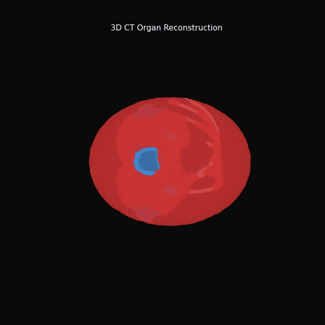
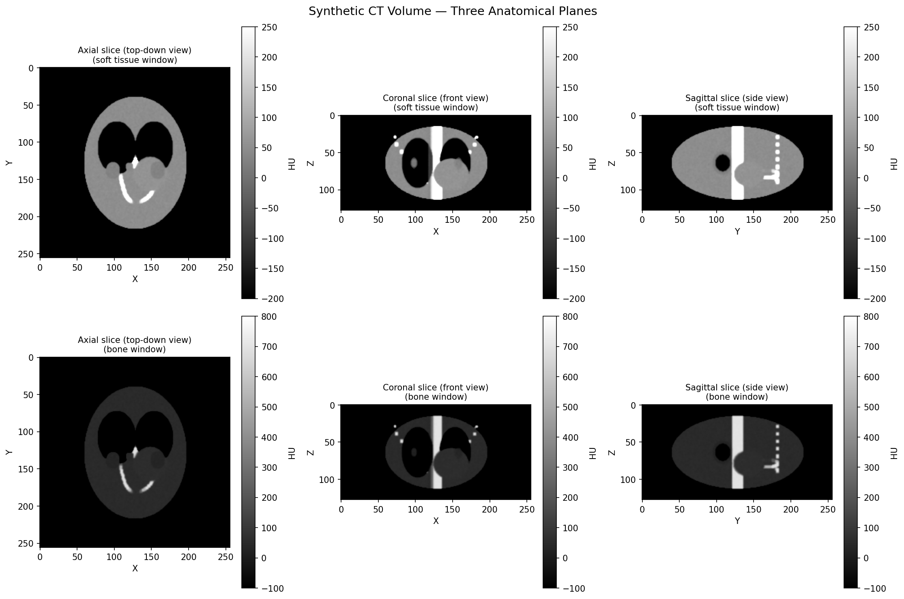
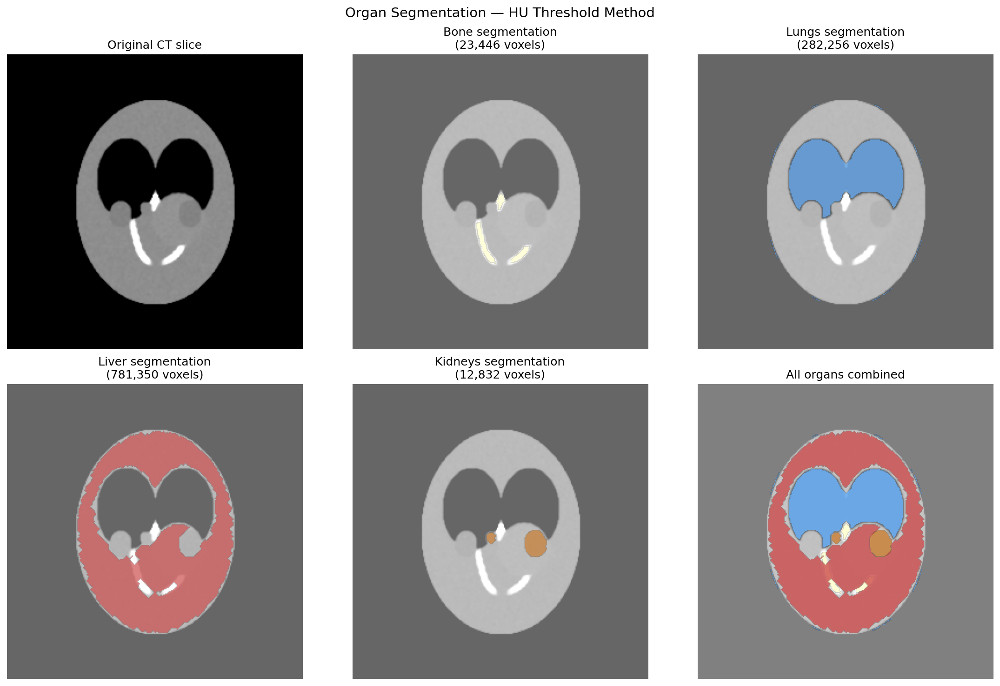
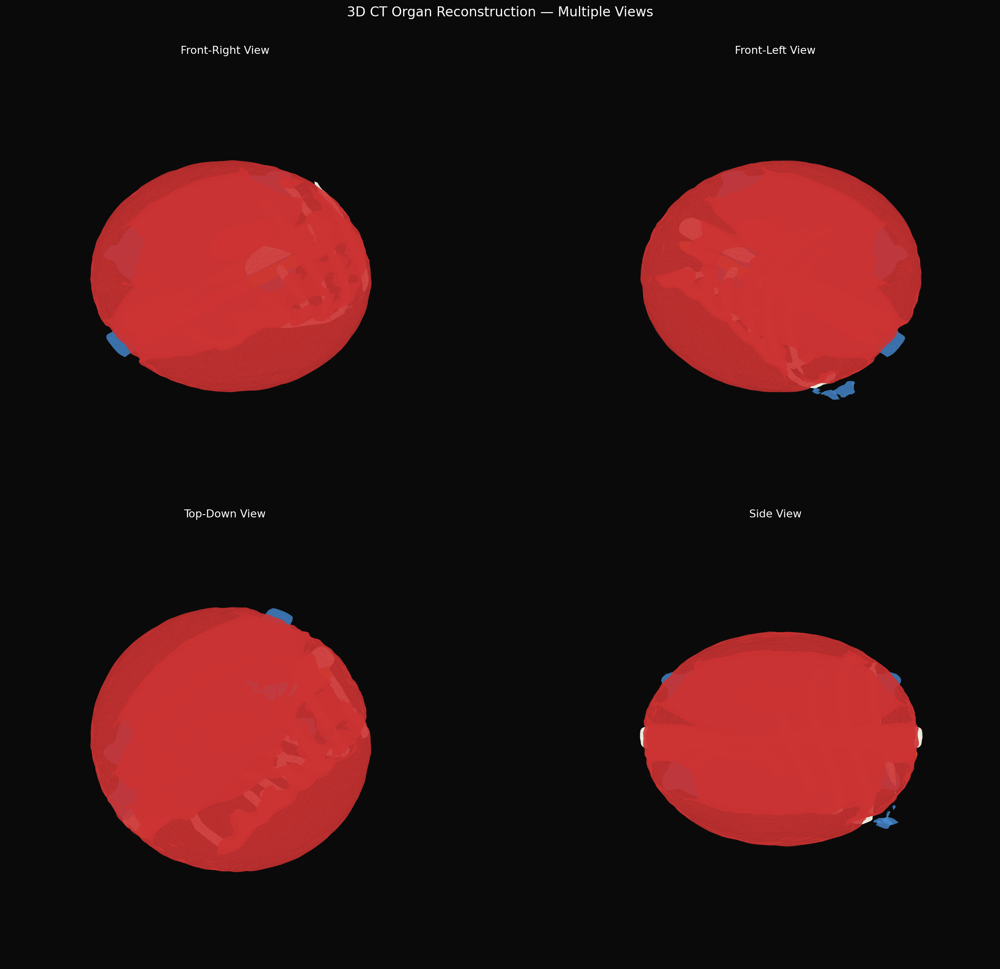

# CT Organ Reconstruction

Interactive 3D reconstruction of human organs from CT scan stacks —
segmenting bones, lungs, liver and kidneys then rendering photorealistic
surface meshes.

---

## 3D Reconstruction Demo



*Rotating 3D reconstruction showing bone (ivory), lungs (blue),
liver (red) and kidneys (orange) — generated from a synthetic CT volume
using Marching Cubes surface reconstruction.*

---

## Pipeline
```
CT Volume → HU Thresholding → Morphological Cleanup → Marching Cubes → 3D Mesh → PyVista
```

## Sample outputs







---

## Tech stack

| Layer | Technology |
|---|---|
| Volume generation | NumPy, SciPy |
| Segmentation | HU thresholding + morphological operations |
| Surface reconstruction | scikit-image Marching Cubes |
| 3D rendering | Matplotlib 3D, Poly3DCollection |
| Mesh export | Binary STL format |
| Animation | Matplotlib FuncAnimation |

---

## Results

| Organ | Voxels | Vertices | Faces |
|---|---|---|---|
| Bone | 23,446 | 15,908 | 31,784 |
| Lungs | 282,256 | 10,166 | 20,308 |
| Liver | 781,350 | 33,648 | 67,332 |
| Kidneys | 12,832 | 6,240 | 12,472 |

---

## Project structure
```
ct-organ-reconstruction/
├── notebooks/
│   ├── 01_data_exploration.ipynb
│   ├── 02_segmentation.ipynb
│   └── 03_3d_reconstruction.ipynb
├── outputs/
│   ├── rotation.gif
│   ├── ct_slices.png
│   ├── segmentation.png
│   ├── 3d_multiview.png
│   └── meshes/
│       ├── bone.stl
│       ├── lungs.stl
│       ├── liver.stl
│       └── kidneys.stl
├── docs/
│   └── SPEC.md
└── README.md
```

---

## Progress log

- [x] Project defined and documented
- [x] CT data loading and exploration
- [x] Organ segmentation — bone, lungs, liver, kidneys
- [x] 3D surface reconstruction — Marching Cubes
- [x] Multi-view rendering
- [x] Rotating animation GIF
- [x] STL mesh export
- [x] Real DICOM data loading and visualization

---

## Author

**Hidayet Allah Yaakoubi**
BME student — Tunisia